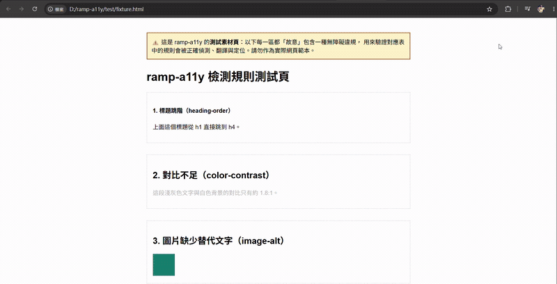

# Ramp (ramp-a11y)

[English](README.en.md) · [繁體中文](README.md)

[](https://github.com/HSU-YU-MING/ramp-a11y/actions/workflows/ci.yml)
[](https://www.npmjs.com/package/cornhsu-ramp-scan)
[](https://www.npmjs.com/package/cornhsu-ramp-scan)

A web accessibility (a11y) checker — a Chrome / Edge browser extension (Manifest V3).

Ramp scans the page you are actually viewing (the real, post-JavaScript DOM), uses the open-source [axe-core](https://github.com/dequelabs/axe-core) engine to find WCAG issues, and explains **in Traditional Chinese** why each is a barrier and how to fix it — mapping every finding to **Taiwan's official "Website Accessibility Guidelines"** (準則 numbers and A / AA / AAA conformance levels).

> **Why this matters:** international tools (axe, WAVE, Lighthouse) report against WCAG in English but do not map to Taiwan's local regulation, inspection codes, or accreditation scheme. Ramp fills that gap: modern, in-browser, Traditional-Chinese, and mapped to the Taiwan standard.

**[Project write-up](https://cornhsu.com/ramp-a11y) · [Chrome Web Store](https://chromewebstore.google.com/detail/bbdbehdknkmhpbolgohjlmikbfganhfm) · MIT**

## Demo



> Full flow on the [test fixture page](test/fixture.html): **scan → level-grouped issues → expand for "why / how to fix / NVDA preview" → click an element to highlight it on the page → switch to the "Reading Order" and "Live Regions" tabs.**

## Install

👉 **[Install from the Chrome Web Store](https://chromewebstore.google.com/detail/bbdbehdknkmhpbolgohjlmikbfganhfm)** (works on Chrome and Edge).

Click the Ramp toolbar icon on any normal page → "開始檢測" (Start scan). Shortcut: `Ctrl+Shift+U`. To load from source, see [From source](#from-source-developers).

## Features

- **One-click scan** of the current tab, results grouped by **A / AA / AAA** level, sorted within a group by axe severity (critical → minor).
- **Taiwan-regulation mapping**: every issue is labelled with the Taiwan 準則 number, category (Perceivable / Operable / Understandable / Robust), conformance level, and — for 34 rules — the official inspection code (e.g. `HM1240200C`) so reports line up with the government's Freego tool.
- **Traditional-Chinese, educational explanations**: each finding says *why it is a barrier* and *how to fix it*, not just an error code.
- **Click-to-locate**: click an affected element and Ramp highlights it on the live page and scrolls to it (respecting `prefers-reduced-motion`).
- **NVDA screen-reader preview**: under each finding, Ramp shows how [NVDA](https://www.nvda.org.tw/) (the most common free screen reader in Taiwan) would announce the element — **name + role + value + state + set position + item count + description + table coordinates**. Wording is verified against NVDA's official `zh_TW` localization and cross-checked against **real NVDA** driven by Guidepup (two modes: Tab traversal + line-by-line browse mode).
- **Reading-order preview**: linearizes the whole page into NVDA's actual reading sequence, marks landmark/table/list enter-exit boundaries, and flags **order mismatches** (visual left-to-right order vs. reading order on the same row — WCAG 1.3.2).
- **Live-region monitoring**: a `MutationObserver` watches `aria-live` / `role=alert` / `status` / `log` regions and lists what NVDA would auto-announce, with priority (`assertive` vs `polite`).
- **Honest self/manual split**: axe `incomplete` results are marked "needs manual review" — no misleading "fully compliant" verdict.
- **Manual-review self-assessment**: mark review items pass/fail, persisted per URL and included in the exported report.
- **Report export**: one-click self-contained HTML report (open to read, print to PDF).
- **Dark mode**, **target level** (default AA), **result filter** (all / violations / review), and **scan delay** (3 / 10 s for animated or lazy-loaded pages).

## Real-world case study

Ramp scanned the home page of a **live Taiwanese central-government ministry website** (checked July 2026). It is presented anonymously out of respect for the site owner, and the content may have changed since — the point is to show the tool's output on a real page.

| Metric | Result |
|--------|--------|
| Violations | **4 rules, 23 affected elements** (all level A) |
| Best-practice advisories | 1 rule (13 elements) |
| Needs manual review | 2 rules — including **102** text-contrast cases axe could not decide automatically |

The four violations, with Ramp's simulated NVDA announcement:

1. **Images missing alt text** (1.1.1 / A / 6) — NVDA says only "圖片" (image); the information is lost.
2. **Links with no discernible text** (2.4.4 / A / 3) — NVDA says only "連結" (link); the destination is unknown.
3. **ARIA role missing a required parent** (1.3.1 / A / 11) — tab labels lack a `tablist` container, breaking screen-reader navigation.
4. **Unsupported ARIA attribute** (4.1.2 / A / 3) — `aria-pressed` on an element that does not support it, so state is unreliable.

This case highlights Ramp's three design goals: **map to the Taiwan standard**, **preview the NVDA experience**, and **stay honest** — the 102 contrast cases are flagged for manual review rather than passed or failed, because no automated tool can reliably judge text contrast over background images.

## Full-site CLI (`ramp-scan`)

The extension scans one tab. To **audit a whole site**, Ramp ships a local Node CLI that runs the **exact same** scan and Taiwan-standard mapping on every page — the extension (interactive, single-page) and the CLI (batch, whole-site) are driven by **one shared mapping core** ([`shared/report-core.js`](shared/report-core.js)), written once and reused, with the module boundary preventing drift. No backend, no hosting — it runs locally.

Published on npm as [`cornhsu-ramp-scan`](https://www.npmjs.com/package/cornhsu-ramp-scan) — no clone needed (requires a local Chrome; set `--chrome` / `CHROME_PATH` if it isn't auto-found):

```sh
npx cornhsu-ramp-scan https://example.com --depth 2 --format html  # zero-install
npm i -g cornhsu-ramp-scan && ramp-scan https://example.com        # or install globally
npm run scan -- --url-list url_inventory.csv --format html         # from a repo checkout
```

It emits structured **JSON** (drop into CI) and a self-contained **HTML** report styled like the extension's export (site summary → most common barriers → per-page detail). This turns a dev-time single-page pre-check into an automatable, whole-site localized audit — the piece that lets Ramp slot into a delivery pipeline.

**Composes with [PolyMigrate](https://github.com/HSU-YU-MING/cornhsu-polymigrate).** `--url-list` reads the `url_inventory.csv` produced by PolyMigrate (my i18n-first static-site migrator); when the list carries a `lang` column, Ramp additionally reports accessibility **per language** — so a migrated multilingual site can be audited for its Chinese and English versions separately (e.g. the zh page failing rules the en page doesn't). Two tools, one workflow: migrate the multilingual site, then audit each language's accessibility.

> **Use responsibly:** crawling sends real requests. **Sequential by default, 250 ms spacing**; `--concurrency` speeds crawls up but raises instantaneous load on the server. Scan sites you own or are authorized to test, and bound load with `--delay` / `--concurrency` / `--max-pages`. Architecture and scope: [docs/fullsite-cli-plan.md](docs/fullsite-cli-plan.md).

## Permissions

Ramp does **not** request persistent all-sites access. It uses only:

- `activeTab` — temporary access to the current tab, granted only when you click the icon.
- `scripting` — to inject axe-core and the scanner.
- `storage` — session cache of scan results (cleared when the browser closes; never leaves your machine).

All analysis runs locally in your browser; no data is sent to any server.

## From source (developers)

1. Clone this repo.
2. Open `chrome://extensions/` (Edge: `edge://extensions/`).
3. Enable **Developer mode**.
4. Click **Load unpacked** and select the project folder (the one containing `manifest.json`).

## Development & testing

```sh
npm install
npm run lint         # ESLint (flat config)
npm run format:check # Prettier
npm run test:unit    # Pure-function unit tests (jsdom, no Chrome): 47 checks
npm run test:self    # Static a11y contract test on the popup: 13 checks
npm run test:cli     # Full-site CLI pure-function tests (URL/CSV/aggregate/target-split): 28 checks
npm test             # End-to-end (needs local Chrome; CHROME_PATH to override): 53 checks
npm run test:nvda    # Real-NVDA comparison (interactive desktop; see test/nvda/)
```

Everything except e2e/nvda runs automatically on every push/PR via [GitHub Actions](.github/workflows/ci.yml); e2e also runs in CI under xvfb with a stable Chrome. See the Traditional-Chinese README for e2e troubleshooting.

## Limitations (important)

- **Automated checks cover only ~30–40%** of accessibility problems. Keyboard flow, real screen-reader experience, and whether content is *appropriate* still require human review.
- Results are **not** equivalent to any official accessibility accreditation; apply through the official process if you need a badge.
- The mapping table covers **73 axe rules** across the **27 auto-detectable** success criteria of the Taiwan standard; the rest (keyboard traps, caption quality, reading order, …) inherently require manual testing.
- Cross-origin iframe content is out of scope (MVP limitation).

## Standards & versions

Ramp targets Taiwan's "Website Accessibility Guidelines", currently in a transition between two versions:

| Version | Aligns with | Success criteria | Applies |
|---------|-------------|------------------|---------|
| 110.07 | WCAG 2.1 | 78 | current, until 2026-11-29 |
| 115 amendment | WCAG 2.2 | 87 (adds 9, removes 4.1.1) | **effective 2026-11-30** |

Differences that affect specific criteria (4.1.1, 2.5.8) are annotated in the results and report. Official PDFs are included under `docs/`.

## License & credits

- Code: [MIT License](LICENSE).
- Engine: [axe-core](https://github.com/dequelabs/axe-core) **v4.10.3** (MPL-2.0), bundled locally in `vendor/axe.min.js`. Re-verify `data/rules-map.json` when upgrading axe.
