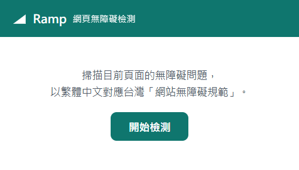
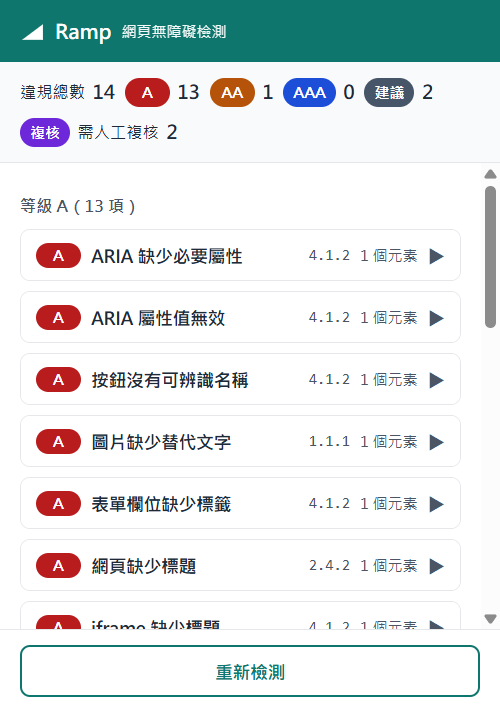
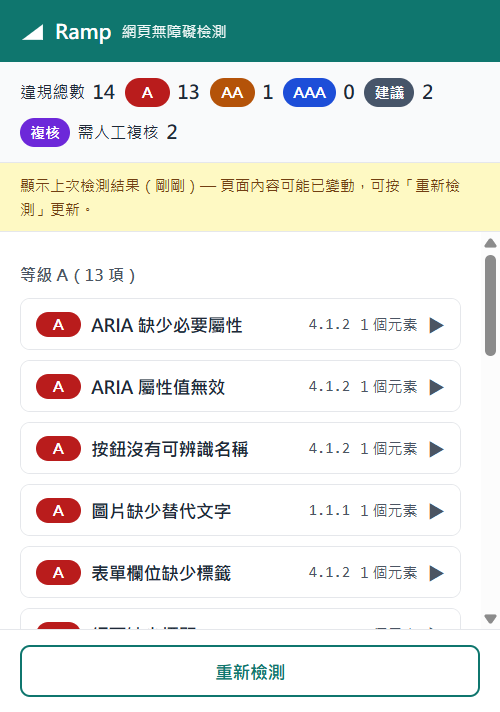
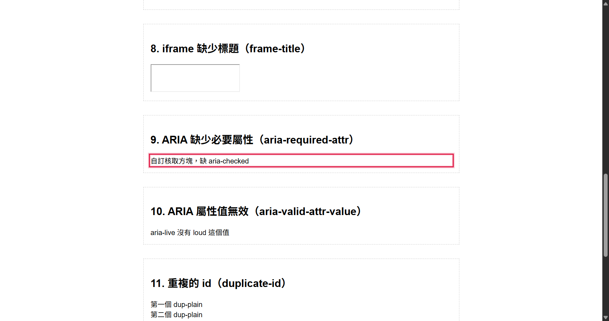

# Ramp（ramp-a11y）

網頁無障礙（Web Accessibility / a11y）檢測工具 —— Chrome / Edge 瀏覽器擴充套件（Manifest V3）。

掃描你目前瀏覽的網頁（JavaScript 執行後的實際 DOM），以開源檢測引擎 [axe-core](https://github.com/dequelabs/axe-core) 找出 WCAG 無障礙問題，並以**繁體中文**說明問題成因與修正方式，對應到**台灣「網站無障礙規範」**的準則編號與 A / AA / AAA 檢測等級。

**[作品介紹與開發故事](https://cornhsu.com/ramp-a11y) · [Chrome 線上應用程式商店](https://chromewebstore.google.com/detail/bbdbehdknkmhpbolgohjlmikbfganhfm) · MIT**

## 安裝

👉 **[從 Chrome 線上應用程式商店安裝](https://chromewebstore.google.com/detail/bbdbehdknkmhpbolgohjlmikbfganhfm)**（Chrome／Edge 皆適用）

安裝後工具列會出現 Ramp 圖示。開啟任一一般網頁 → 點擊圖示 →「開始檢測」即可（也可用快捷鍵 `Ctrl+Shift+U`）。開發者若要從原始碼載入，見下方[〈從原始碼安裝〉](#從原始碼安裝開發者)。

## 功能

- 一鍵掃描當前分頁，依 **A / AA / AAA 等級分組**呈現違規項目，同組內依 axe 嚴重度（critical → minor）排序
- 頂部統計列：違規總數、各等級數量、最佳實務建議數、需人工複核數
- 每項問題提供繁中的「為什麼是障礙」與「如何修正」，並標示台灣規範準則編號、類別（可感知／可操作／可理解／強健）與影響程度
- 點擊受影響元素 → 在原網頁**高亮定位**並自動捲動過去（尊重使用者的減少動態效果設定）
- **NVDA 報讀預覽**：每個受影響元素下方顯示模擬 [NVDA](https://www.nvda.org.tw/)（盲用視窗資訊系統，台灣最普及的免費螢幕報讀軟體）會怎麼念出它，完整涵蓋 **名稱＋角色＋值＋狀態＋集合位置＋項目數＋描述＋表格座標**（表格儲存格會念「第 N 列 第 N 欄」與關聯的欄/列標題，表格本身念「表格有 N 列 M 欄」）——例如「帳號 編輯區 『user123』（請輸入 6 到 12 個英數字）」「音量 滑桿 『30』」「關於我們 清單項目 6 之 2」「更多 功能表按鈕 折疊 子功能表」。名稱以 axe 的 accessible name 引擎計算，其餘用詞逐條校對自 NVDA 官方正體中文翻譯（`zh_TW`），**並以 Guidepup 驅動真實 NVDA 進行雙模式（Tab 走訪＋瀏覽模式逐行）對照驗證——過程中抓出並修正 6 個與真實播報的落差**（驗證紀錄與工具見 [test/nvda/](test/nvda/README.md)）。讓不會操作報讀軟體的開發者也能「看見」朗讀內容
- **朗讀順序預覽**：切換到「朗讀順序」分頁，把整頁**線性化**成 NVDA 實際念出的先後順序（依 DOM 順序，行內連結會插在文字中間；**地標與表格會標出「進入／離開」邊界**，如「導覽區 地標」「表格有 N 列 M 欄」「清單 有 N 項」「離開表格」），並標出「**順序落差**」——同一視覺列上畫面由左到右的順序與朗讀先後相反（flex `order`、`float:right`、RTL 等造成的 WCAG 1.3.2 有意義順序問題）。點任一停點即在原頁面高亮定位
- **動態播報（即時區域）**：切換到「動態播報」分頁後，以 `MutationObserver` 監看頁面的**即時區域**（`aria-live`、`role=alert`／`status`／`log`…）。在頁面上觸發動態變化（表單錯誤、儲存提示、即時搜尋…）時，NVDA 會自動播報的內容會依時間軸列出，並標示播報優先度（`assertive` **立即打斷**／`polite` **依序播報**）。監看在頁面端持續累積，popup 因失焦關閉後重開仍看得到期間捕捉的播報——這是唯一無法用靜態快照呈現、必須「動態模擬」的部分
- axe 判定為 incomplete 的項目標示為「**需人工複核**」
- 內建 axe 官方 **zh_TW 語言包**：未在對應表中的規則也以繁中顯示，僅標示「未對應台灣規範準則」
- axe 的**最佳實務建議**（非 WCAG 失敗項）獨立分組，不灌水「違規」數字
- **結果快取**：popup 關閉重開時，同一分頁、同一網址的上次結果會自動還原，不必重掃
- **匯出報告**：一鍵下載自包含的 HTML 檢測報告（含統計、全部問題與元素清單、限制聲明），瀏覽器開啟即可閱讀、列印即可轉 PDF
- **深色模式**：跟隨系統 `prefers-color-scheme` 自動切換，深色下所有文字對比仍維持 ≥ 4.5:1
- **目標等級**（對應官方工具的檢測等級設定）：預設 AA，超出目標的項目獨立分組不干擾
- **結果篩選**：全部／違規／複核 一鍵切換
- **人工複核自評**：需人工複核項目可逐項標記通過／不通過，依網址持久保存並納入匯出報告（對應官方自我評量流程）
- **官方檢測碼**：34 條規則標示規範附件一的檢測碼（如 `HM1240200C`），報告可與 Freego 逐碼對照
- **掃描前等待**：可設 3／10 秒延遲，應付動畫與延遲載入較多的頁面
- **鍵盤快捷鍵**：預設 `Ctrl+Shift+U` 開啟檢測（可於 `chrome://extensions/shortcuts` 調整）
- **登入頁面天然支援**：掃的就是你目前登入狀態下的真實頁面，無須像官方工具另行設定帳密
- 受保護頁面（`chrome://`、擴充功能商店等）與掃描失敗有明確的繁中錯誤提示

## 權限說明

本擴充套件**不要求「所有網站」的常駐權限**，只使用：

- `activeTab`：使用者主動點擊圖示時，才臨時取得當前分頁的存取權
- `scripting`：注入 axe-core 與掃描腳本
- `storage`：以 session storage 快取掃描結果（關閉瀏覽器即清除，不落地、不外傳）

所有檢測都在你的瀏覽器本機完成，不傳送任何資料到外部伺服器。

## 從原始碼安裝（開發者）

（一般使用者請用上方的[商店安裝](#安裝)；以下是開發者載入未封裝項目 / Load unpacked 的方式。）

1. 下載或 clone 本專案到本機資料夾。
2. 開啟 Chrome，網址列輸入 `chrome://extensions/`（Edge 為 `edge://extensions/`）。
3. 開啟右上角的「**開發人員模式**」。
4. 點擊「**載入未封裝項目**」（Load unpacked）。
5. 選擇本專案的資料夾（含 `manifest.json` 的那一層，即 `ramp-a11y/`）。
6. 工具列出現 Ramp 圖示後，開啟任一一般網頁，點擊圖示 →「開始檢測」。

## 測試素材頁

[test/fixture.html](test/fixture.html) 是一個**故意**塞滿已知違規的測試頁，覆蓋對應表中的每一條規則（缺 alt、低對比、無 label、重複 id⋯），可用來驗證檢測、翻譯與高亮定位都正常。

用瀏覽器直接開啟該檔案（`file://`）測試前，需在 `chrome://extensions/` 的 Ramp 詳細資料頁開啟「**允許存取檔案網址**」；或用任一本機伺服器（如 `npx serve test`）以 http 開啟。

## 功能截圖

| 初始畫面 | 檢測結果（分組＋統計列） |
|---|---|
|  |  |

| 快取還原提示 | 點擊元素在頁面上高亮定位 |
|---|---|
|  |  |

## 專案結構

```
ramp-a11y/
├── manifest.json            # MV3 設定：權限、popup、圖示
├── popup/                   # 介面（四種狀態：初始／載入中／結果／錯誤）
├── content/scanner.js       # 注入頁面的掃描與高亮函式
├── background/service-worker.js  # 極簡背景腳本（保留擴充彈性）
├── data/rules-map.json      # axe 規則 → 台灣「網站無障礙規範」對應表
├── vendor/
│   ├── axe.min.js           # 本地打包的 axe-core（MV3 CSP 不允許遠端載入）
│   └── axe-locale-zh_TW.js  # axe 官方 zh_TW 語言包（包裝為可注入的 JS）
├── test/fixture.html        # 故意違規的測試素材頁
└── icons/                   # 擴充套件圖示（佔位圖）
```

## vendor 檔案的取得與更新

兩個 vendor 檔案皆來自 npm 套件 `axe-core@4.10.3`，更新版本時重跑以下步驟並校對 `rules-map.json`：

```sh
# 1. 檢測引擎本體
curl -sL -o vendor/axe.min.js https://cdn.jsdelivr.net/npm/axe-core@4.10.3/axe.min.js

# 2. 官方 zh_TW 語言包，包裝成注入用 JS（在 axe.min.js 之後注入）
curl -sL -o /tmp/zh_TW.json https://cdn.jsdelivr.net/npm/axe-core@4.10.3/locales/zh_TW.json
{ printf 'if (window.axe) {\n  window.axe.configure({\n    locale: '; cat /tmp/zh_TW.json; printf '\n  });\n}\n'; } > vendor/axe-locale-zh_TW.js
```

## 開發與測試

端對端迴歸測試（狀態切換、掃描、繁中轉譯、NVDA 報讀預覽、朗讀順序線性化、動態播報監看、高亮定位、快取還原、受保護頁面）：

```sh
npm install
npm run test:unit  # 純函式單元測試（jsdom，數秒，不需 Chrome）：38 項
npm test           # 端對端；需本機安裝 Chrome，可用 CHROME_PATH 指定位置：53 項
npm run test:nvda  # 真實 NVDA 對照（需互動桌面，NVDA 會出聲；見 test/nvda/README.md）
```

- **單元測試** [test/unit/run-unit.js](test/unit/run-unit.js)：以 jsdom 載入 scanner 的內部純函式
  （NVDA 值／位置／狀態／表格、地標判定、視覺落差偵測），對合成 DOM 快速驗證，並檢查
  manifest 與 package 版本一致。這些邏輯不依賴版面，可秒級迭代，補足 e2e 的覆蓋。
- **端對端** [test/e2e/run-e2e.js](test/e2e/run-e2e.js)：啟動獨立 Chrome 視窗（暫存 profile，
  不影響日常瀏覽器）跑完整流程；細節與已知限制（activeTab 無法程式化授權）見檔頭註解。
- **真實 NVDA 對照** [test/nvda/](test/nvda/README.md)：以 [Guidepup](https://www.guidepup.dev/)
  驅動真正的 NVDA 走過測試頁、擷取實際語音，與模擬並排比對——**雙模式（Tab 走訪＋瀏覽模式
  逐行）皆已驗證吻合**，表格座標「第 N 列 第 N 欄」等皆經真 NVDA 親口證實；過程中抓出的
  6 個用詞落差（編輯區、功能表按鈕、表格語序、進度值、清單項目數、地標後綴）均已修正。

## 限制聲明（重要）

- **自動化檢測僅能涵蓋約三到四成的無障礙問題。** 鍵盤操作動線、報讀軟體實際體驗、內容語意是否恰當等，仍必須以人工方式複核。
- 本工具的檢測結果**不等同**於任何官方無障礙標章或認證（如 NCC「無障礙網路空間服務網」的標章檢測）；如需申請標章，請依官方流程送測。
- 「需人工複核」項目代表 axe 無法自動判定，不代表沒有問題。
- 跨來源 iframe 內的內容目前不在掃描範圍內（MVP 限制）。
- 對應表收錄 **73 條 axe 規則**的台灣準則對應與繁中解說，涵蓋台灣「網站無障礙規範」成功準則中**可自動化檢測的 27 條**；其餘準則（鍵盤陷阱、字幕品質、閱讀順序等）本質上需人工檢測，任何自動化工具都無法涵蓋。
- axe 的純最佳實務規則（29 條）獨立顯示為「建議」，不計入違規。
- 準則 4.1.1「語法分析」：110.07 版包含（本工具因此重新啟用 axe 已預設停用的 `duplicate-id` 規則），**115 年修正版已刪除**——結果中附註說明，115 年 11 月 30 日後可移除。
- 準則 2.5.8「目標尺寸(最小)」：**115 年修正版新增**（對齊 WCAG 2.2），本工具已對應 axe 的 `target-size` 規則並附註生效日。
- 準則 2.4.7「焦點可視」沒有對應的 axe 自動化規則，鍵盤焦點是否明顯**一律需要人工檢測**（對應表保留該條目作為規範文件用途）。

## 標準版本與參考文件

本工具對應台灣「網站無障礙規範」，目前處於新舊版過渡期：

| 版本 | 對齊 | 成功準則 | 適用期間 |
|------|------|---------|---------|
| 110.07 版 | WCAG 2.1 | 78 條 | 現行，至 115 年 11 月 29 日 |
| 115 年修正版 | WCAG 2.2 | 87 條（新增 9 條、刪除 4.1.1） | **115 年 11 月 30 日起生效** |

兩版差異影響到的條目（4.1.1、2.5.8）在檢測結果與報告中均有附註說明，其餘對應兩版通用（準則編號與官方名稱一致）。

- [docs/tw-web-accessibility-spec-115.pdf](docs/tw-web-accessibility-spec-115.pdf)：**115 年修正版**官方全文（數位發展部 115 年 5 月），
  發布令見 [docs/tw-moda-order-11540006711.pdf](docs/tw-moda-order-11540006711.pdf)（數位政府字第11540006711號令，自 115.11.30 生效）。
- [docs/tw-web-accessibility-spec-110.pdf](docs/tw-web-accessibility-spec-110.pdf)：110.07 版官方全文，
  取自[植根法律網收錄版本](https://www.rootlaw.com.tw/Attach/L-Doc/A040410001016300-1100318-1000-001.pdf)。
- 對應表中的準則編號、官方準則名稱（`twGuidelineName`）與檢測等級均以上述官方文件為準。
- 規範的檢測碼末碼區分 **C（可用軟體檢測）** 與 **E（人工稽核評量）**，
  本工具的「自動化違規／需人工複核」分流即對應此制度；官方檢測工具 Freego 的報告欄位（軟體／人工）亦同。

## 待辦與路線圖

**時限性待辦**

- [ ] **2026-11-30（115 年修正版生效日）**：發布 v1.1.0 版本切換
  - 移除 [content/scanner.js](content/scanner.js) 中 `duplicate-id` 的重新啟用（新版規範已刪除 4.1.1）
  - 退役 rules-map 中的 `duplicate-id` 條目
  - 清除 4.1.1 與 2.5.8 條目的過渡期附註（`noteZh`）
  - README 標準版本對照表改以 115 年修正版為現行版
- [x] 商店審查通過並上架：README 已加上 [Chrome Web Store 安裝連結](https://chromewebstore.google.com/detail/bbdbehdknkmhpbolgohjlmikbfganhfm)

**規劃中功能**

- [x] **報讀預覽（第一階段：單一元素，NVDA）** — 已完成。在受影響元素下方顯示模擬朗讀結果，
  涵蓋 **名稱＋角色＋值＋狀態＋集合位置＋清單項目數＋描述**（值＝輸入內容／選中項／滑桿數值／
  進度值；狀態含勾選、展開、必要的、多行、有自動完成、子功能表、排序、忙碌…；位置＝aria-posinset/setsize
  或原生清單/選項/單選鈕計算）。技術基礎：axe 的 accessible name 計算引擎
  （`axe.commons.text.accessibleText` / `axe.commons.aria.getRole`，需於 `axe.run` 後
  重新 `axe.setup()` 重建虛擬 DOM 樹才可用）＋校對自 NVDA 官方 `zh_TW` 翻譯的完整對照表
  （內嵌於 [content/scanner.js](content/scanner.js)）。目前聚焦 NVDA；Lynx、導盲鼠、JAWS、
  大眼睛等其他報讀環境暫不涵蓋。
- [x] **整頁朗讀順序預覽（第二階段）** — 已完成。線性化整頁無障礙樹成 NVDA 朗讀順序，
  比對視覺順序標出落差（見上方功能說明）。核心於 [content/scanner.js](content/scanner.js) 的
  `__rampA11yReadingOrder()`：DFS 走訪 DOM、物件（連結／按鈕／表單…）為獨立停點、文字依
  區塊斷句，並以「同一視覺列 top 分帶、列內 left 排序」比對朗讀先後偵測反序。
  目前落差偵測聚焦**同列水平反序**（高信心、低誤報）；多欄版面的跨欄閱讀順序與純垂直重排
  暫不標示，避免誤報。
- [ ] 全站爬掃：如有需求，以獨立 CLI 工具實作（Node＋Puppeteer＋共用 rules-map.json），
  不做進擴充套件（權限模型與架構考量見 commit 歷史）

## 授權與致謝

- 本專案程式碼以 [MIT License](LICENSE) 授權。
- 檢測引擎：[axe-core](https://github.com/dequelabs/axe-core) **v4.10.3**（MPL-2.0），以本地檔案形式打包於 `vendor/axe.min.js`。升級 axe 版本時請一併校對 `data/rules-map.json` 的規則異動。
